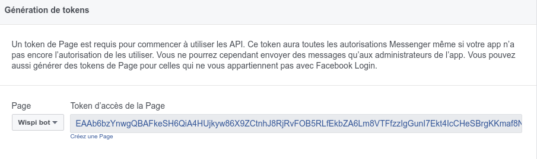

# Install

 Pour installer le bot Messenger Wispi:

1. Enregistrez une nouvelle app sur [Facebook Developers](https://developers.facebook.com)
2. Ajoutez Messenger en produit et récupérez le token d'accès de la page 
3. Ouvrez le fichier src/config et modifiez la valeur de la variable `PAGE_ACCESS_TOKEN` par celle donnée par facebook
4. Ajoutez un webhook en dessous de la page de Token et spécifiez l'url de votre serveur
5. Allez dans src puis faites un ./install.sh puis un ./run.sh
6. Les unit test et le code coverage peut être check avec ./test.sh
