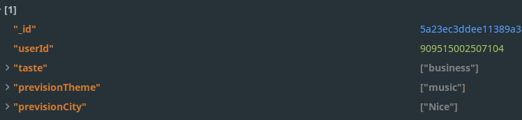

# Problèmes

 Nous avons rencontrés différents problèmes durant le dévelloppement de notre Bot.

## Le déploiement du serveur

  Nous avons du acheter un nom de domaine, un serveur, le configurer.  
  Lorsque nous avons lancé notre bot pour la première fois et que Facebook nous a indiqué que nous devions avoir un url en https nous avons du apprendre a génerer des certificats SSL mais aussi a configurer Nginx.

## Récupération des gouts de l'utilisateur

 Notre bot devait aller récupérer sur les réseaux sociaux les gouts de l'utilisateur et ainsi déterminer ses centres d'interet.

 Pour avoir accès a cette fonctionnalité, nous n'avions qu'a demander a Facebook  
 Seul problème, pour avois accès a ces infos il faut demander a Facebook de 'review' notre application et nous donner son feu vert.  
 Malheureusement pour cela, il faut déjà avoir une application fonctionnelle, ce que nous n'avions pas 2 semaines (temps de la review) avant le rendu.

 **Solution**

  Nous avons donc crée un menu pour demander a l'utilisateur de rentrer manuellement ses gouts.
  De plus, nous mémorisons les recherches de l'utilisateur afin de par la suite pouvoir déterminer ses gouts
  

