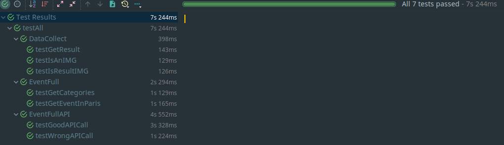
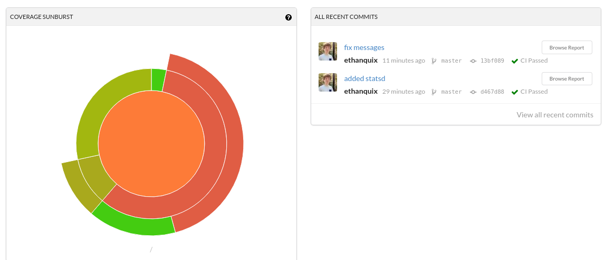

# Technologies utilisées:

## Sommaire
> [Introduction](#Introduction)  
> [Choix du langage](#Choix_du_langage)  
> [Choix des modules Python](#Choix_des_modules_Python)  
> [Choix des API](#Choix_des_API)  
> [Unit test](#Unit_test)  
> [Deploiement](#Deploiement)  
> [Agile Dev](#Agile_Dev)


## Introduction <a id="Introduction"></a>

 Notre projet consiste en un BOT Messenger. Les raisons de ce choix sont expliquées dans le document 'Détail des différentes étapes'

 Il nous fallait pouvoir:
 > Récuperer les messages envoyé par l'utilisateur a notre page  
 > Analyser le message  
 > Chercher les évènements correspondant a sa recherche  
 > Leur trouver une image  
 > Les rendre a l'utilisateur en utilisant les fonctionnalitées de Facebook  
 > Sauvegarder ses choix  
 > Analyser des tweets, extraire les informations pertinentes et les envoyer
 > Executer des Unit Test  
 > Deployer  
 > S'organiser  
 > Utiliser du Code Review

 Pour réaliser ce BOT Messenger, plusieurs options s'offraient a nous:
 - Utiliser une solution web déjà faite consistant majoritairement a du glissé-déposé
 - Le faire entièrement a la main

 Afin d'avoir le plus de possibilitées ouvertes et ne pas être limités, nous avons décidé de le faire entièrement a la main.

## Choix du langage <a id="Choix_du_langage"></a>

 Après nous être documentés sur internet, nous avons décidé d'utiliser Python. En effet, la majorité de l'équipe connaissait déjà ce langage.
 &
 Les performances de ce langage convenaient parfaitement pour cette utilisation, nous ne cherchons pas a faire du code critique qui s'éxècute en quelques millièmes de secondes.

 Nous voulions de plus intégrer de nombreuses fonctionnalitées rapidement. Ce langage haut niveau était donc parfait, nous aurions mis plusieurs mois avec un langage bas niveau comme le CPP

## Choix des modules Python <a id="Choix_des_modules_Python"></a>

 Python possède une communauté très active qui a ainsi dévellopée de nombreux modules.

 Nous avons décidé d'en utiliser certains:

 - [Arrow](http://arrow.readthedocs.io/en/latest/) | Permet de mieux parser les dates
    ```
    t = arrow.get('23-12-2017')
    t.humanize()

    [2 days before christmas]
    ```
    Nous nous en servons ainsi pour parser les dates des evènements et les rendre sous un format plus facilement lisible pour un humain / notre utilisateur

 - [Flask](http://flask.pocoo.org) | Un framework Web

   Flask nous permet de facilement récupérer les requètes de facebook (reception d'un message).

   C'est un Framework petit, léger et robuste, nous l'avons donc choisit car nous n'en demandions pas plus

 - [FBMQ](https://github.com/conbus/fbmq) | FBMQ Nous permet de formater les messages envoyés a Facebook

   Messenger offre de grandes possibilitées de customisation des messages (par exemple quick replies ou bouttons).
   Ce module nous permet de facilement demander cela a Messenger et nous évite d'écrire et formater de longues requètes HTTP.
   ```
    from fbmq import Page
    page = Page('SECRET_KEY')

    Exemple ici nous allons afficher du texte:

    page.send(recipient_id, "hello world!")

    et ici une image:

    page.send(recipient_id, Attachment.Image(image_url))
   ```

## Choix des API <a id="Choix_des_API"></a>

 Il nous faut maintenant choisir des API pour remplir deux taches:

 - Récupérer une liste d'évenements
 - Récupérer des images correspondants a cex évènements

 **Evenements**

  De nombreuses API étaient disponibles, Bandsintown, OpenAgenda, Facebook.

  Malheureusement, la plupart d'entre elles ont leurs désavantages.

  Trop cher pour certaines jusqu'a très limitées pour d'autres (Facebook)

  Nous avons donc décidés d'utiliser EventFull. Leur api était assez complète et simple d'utilisation.
  Gratuite, illimitée, et disposant de la plupart des évènements actuels.

 **Images**

  Une fois nos évènements récupérés il nous fallait maintenant en récupérer des images pour illustrer tout cela.

  Nous avions commencé par utilier l'API de Google Images.  
  Malheureusement, nous nous sommes vites rendu compte que leur api était très lente. (de l'ordre de 10-20 secondes pour une image). Ce qui était bien sur innaceptable.

  Nous avons donc changé pour Qwant ! Le navigateur francais qui propose une api de recherche d'image extrèmement rapide.

## Unit test <a id="Unit_test"></a>

 Les unit test sont l'unes des meilleures manières de s'assurer que notre code marche toujours après en avoir modifié une partie qui pourrait déteindre sur une autre.

 Pour cela, nous les avons pris très au sérieux. Nous avons essayé d'avoir 100% de coverage et de tester absolument tout ce qui était possible.



 Mais nous avons aussi voulu aller plus loin.
 Nous utilisons Travis afin de tester notre code.

 Nous l'avons lié a notre compte github ainsi a chaque push, Travis éxécute tous les tests unitaires présents.

 

 Mais ce n'est pas tout. Nous avons aussi relié Travis a Codecov qui va ainsi nous générer un rendu du code coverage de notre code.



 Cela nous a permis de nous rendre compte en temps réel des problèmes possibles et du code que l'on aurait pu avoir cassé

## Deploiement <a id="Deploiement"></a>
 **Les obligations**

  Pour déployer notre bot, Facebook demandait a ce qu'on l'héberge sur un serveur distant (non localhost), possédant un nom de domaine, et surtout sécurisé par HTTPS.

  Nous avons donc acheté un nom de domaine (wispi.tk) et avons ensuite utilisé [Digital Ocean](https://www.digitalocean.com/) pour héberger notre bot.
  > Nous avons choisi un "droplet" a 512mb de Ram et 1VCPU pour 5€/mois qui est amplement suffisant pour faire tourner notre bot

  Pour générer le certificat https nous avons utilisé [Let's Encrypt](https://letsencrypt.org/) qui nous a permis de générer un certificat SSL gratuitement et facilement
  > `$ letsencrypt nginx`

  Comme proxy inverse, nous utilisé [Nginx](https://www.nginx.com/) pour sa facilité d'utilisation

  Pour monitorer notre application ainsi que notre serveur, nous avons utilisé [Datadog](https://datadoghq.com) qui nous permet de voir en temps réel ce qui se passe mais aussi de définir des trigger dans le code afin d'obtenir différentes metrics  
  Il permet aussi de monitorer le serveur pour nous prévenir si ce dernier crash. Cela permet aussi de controller la consommation en ressources de notre programme

  

## Agile Dev

 Entrainés par nos stage, et motivés par le gain de productivité que cela apportait, nous avons respecté les principes du develloppement Agile.

 Ainsi, nous avons utilisé Youtrack afin de gérer les issues et le temps nécessaire, et upsource en tant qu'outil de code review.

 A chaque push, il fallait 2personnes qui approuvaient le code afin que ce dernier puisse être merge sur la branche Master.

## Documentation
 La documentation a été faite en grande partie en Markdown.

 Le markdown est un format simple, ayant un joli rendu. Surtout, contrairement a un docuement Word, il n'y a aucun problème de compatibilité lors de l'édition de la documentation a plusieurs.

 [Couscous.io](https://couscous.io) nous permet de générer cette documentation facilement et de la rendre sur github.

## Autre

 Nous avons aussi utilié heroku afin de facilement pouvoir déployer notre bot sans avoir besoin d'avoir son propre serveur.

 Un Procfile est disponible a la racine, il suffit donc de déployer cette application avec heroku et elle sera instantanément prête a l'emploi

 
