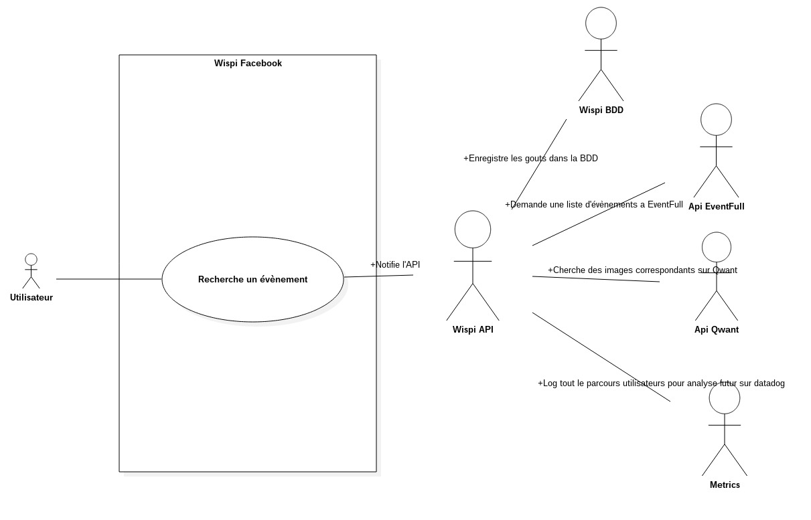

# Cas d'utilisations

1. Un utilisateur envoie un message a Wispi pour rechercher des évènements
 

2. Un utilisateur poste un message sur un réseau social, Wispi le comprends et renvoie possiblement des infos a d'autres utilisateurs
 
